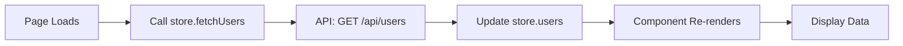
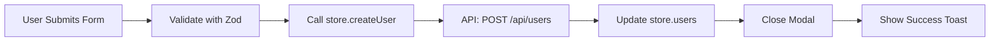
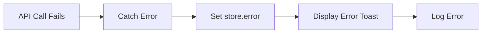

# Phase 2: Frontend Development Plan

## Overview

This guide provides a systematic approach to transform a Frontend PRD into an actionable **Frontend Development Plan**. The process involves analyzing component architecture, defining file structure, creating TypeScript interfaces, and planning implementation roadmap.

This complements [Circe Lessons Phase 2](https://github.com/paper-indonesia/circe-lessons/tree/main/02_Plan) with Frontend-specific strategies.

---

## Table of Contents

1. [The Planning Process](#the-planning-process)
2. [Frontend Plan Structure](#frontend-plan-structure)
3. [10-Phase Prompt Sequence](#10-phase-prompt-sequence)
4. [Component Architecture Patterns](#component-architecture-patterns)
5. [File Structure Planning](#file-structure-planning)
6. [TypeScript Interface Definitions](#typescript-interface-definitions)
7. [Styling Strategy](#styling-strategy)
8. [State Management Planning](#state-management-planning)
9. [Example from Admin Beauty Clinic](#example-from-admin-beauty-clinic)
10. [Best Practices](#best-practices)

---

## The Planning Process

### Input → Transform → Output

```
Frontend PRD → 10-Phase Prompts → Development Plan
```

**Input**: Frontend PRD with UI requirements, component list, responsive specs
**Transform**: Iterative prompts to analyze, design, and plan
**Output**: Actionable development plan with component architecture and file structure

---

## Frontend Plan Structure

### Standard Sections

1. **Current Frontend State**
   - Existing components
   - Current routing structure
   - State management in place
   - Component library installed

2. **Component Architecture**
   - Atomic Design breakdown
   - Component hierarchy
   - Reusable vs. feature-specific

3. **File Structure**
   - Next.js App Router structure
   - Component file locations
   - Type definitions location
   - API client structure

4. **TypeScript Interfaces**
   - Entity interfaces (from API)
   - Form data interfaces
   - Props interfaces
   - State interfaces

5. **Styling Strategy**
   - Tailwind utility classes
   - CSS variables
   - shadcn/ui customization
   - Responsive patterns

6. **State Management**
   - Zustand stores (global)
   - React Context (feature-specific)
   - Server state (React Query / SWR)

7. **Data Flow**
   - API → Store → Component
   - Form → Validation → API
   - Error handling flow

8. **Development Roadmap**
   - Phase 1: Foundation (types, API client)
   - Phase 2: Core UI (components, layouts)
   - Phase 3: CRUD Operations (forms, modals)
   - Phase 4: Polish (animations, optimization)

9. **Testing Strategy**
   - Component tests
   - Visual regression tests
   - Accessibility tests

10. **Tech Stack Documentation References**
    - Links to tech docs created in Phase 2

---

## 10-Phase Prompt Sequence

### Phase 1: Extract Core Requirements from PRD

**Objective**: Understand what UI needs to be built.

#### Prompt 1.1: Component Inventory

```
Given this Frontend PRD: @[PRD_FILE]

Extract a complete inventory of UI components:

1. **Pages**:
   - List all routes/pages mentioned
   - Specify layout (with sidebar, without, etc.)

2. **Organisms** (complex components):
   - Data tables
   - Forms
   - Modals
   - Dashboards
   - Navigation

3. **Molecules** (composite components):
   - Search bars
   - Filter dropdowns
   - Card components
   - Form fields

4. **Atoms** (primitives):
   - Buttons
   - Inputs
   - Labels
   - Icons
   - Badges

5. **External Dependencies**:
   - shadcn/ui components needed
   - Third-party libraries (date pickers, charts)

Format as a structured list with notes on reusability.
```

#### Prompt 1.2: Identify UI States

```
Based on the PRD, identify all UI states needed:

1. **Loading States**:
   - What needs skeleton screens?
   - What needs spinners?
   - Page-level loading vs component-level

2. **Error States**:
   - Form validation errors
   - API error handling
   - Network errors
   - Empty/no results

3. **Empty States**:
   - Which lists/tables need empty states?
   - CTA for each empty state

4. **Success States**:
   - Toast notifications
   - Success messages
   - Redirects

Provide a comprehensive list with UI descriptions.
```

---

### Phase 2: Analyze Current Frontend State

**Objective**: Understand what already exists.

#### Prompt 2.1: Current Component Analysis

```
Analyze the existing frontend codebase at [path]:

1. **Current Components**:
   - List all components in components/
   - Categorize by type (ui/, layout/, features/)
   - Note which are reusable

2. **Current Routing**:
   - List all routes in app/
   - Note page structure
   - Identify layout components

3. **State Management**:
   - Check for Zustand store (lib/store.ts)
   - Check for Context providers
   - Note current patterns

4. **Styling**:
   - Check tailwind.config
   - Check globals.css for CSS variables
   - Note current component library (shadcn/ui, MUI, etc.)

5. **API Integration**:
   - Check existing API client (lib/api/)
   - Note patterns used

Create a "Current Status" section listing:
- ✅ What EXISTS and works
- ⚠️ What EXISTS but needs refactoring
- ❌ What is MISSING
```

---

### Phase 3: Define Component Architecture

**Objective**: Plan component hierarchy using Atomic Design.

#### Prompt 3.1: Atomic Design Breakdown

```
Using Atomic Design principles, organize components from PRD:

**Atoms** (from shadcn/ui or custom):
- List primitive components
- Note if shadcn/ui available or needs custom build
- Example: Button, Input, Label, Badge, Avatar

**Molecules** (combining atoms):
- List composite components
- Specify composition (which atoms)
- Define props interface sketch
- Example: SearchBar = Input + SearchIcon

**Organisms** (complex components):
- List feature-rich components
- Specify composition (which molecules/atoms)
- Note data dependencies (API, props)
- Example: DataTable = Table + SearchBar + Pagination

**Templates** (page-level layouts):
- Define layout structures
- Note where organisms are placed
- Example: DashboardTemplate = Sidebar + Header + Content

**Pages** (Next.js routes):
- Map to app/ directory structure
- Note Server vs Client Component
- Example: app/dashboard/page.tsx

Provide a hierarchy diagram in markdown:

```
Page
├── Template
│   ├── Organism
│   │   ├── Molecule
│   │   │   ├── Atom
│   │   │   └── Atom
│   │   └── Molecule
│   └── Organism
```

---

#### Prompt 3.2: Reusability Analysis

```
For each component, determine:

1. **Reusable Across Features**:
   - Can be used in multiple pages
   - Goes in components/ui/ or components/shared/
   - Examples: Button, Card, Modal

2. **Feature-Specific**:
   - Only used in one feature
   - Goes in components/[feature]/
   - Examples: UserForm, BookingCalendar

3. **Layout Components**:
   - App-wide layout
   - Goes in components/layout/
   - Examples: Sidebar, Header, Footer

Create a file placement plan:

| Component | Reusable? | Location | Depends On |
|-----------|-----------|----------|------------|
| Button | Yes | components/ui/button.tsx | shadcn/ui |
| UserForm | No | components/users/user-form.tsx | User entity |
| Sidebar | Yes (layout) | components/layout/sidebar.tsx | Navigation config |
```

---

### Phase 4: Define File Structure

**Objective**: Plan exact file paths for all components.

#### Prompt 4.1: Next.js App Router Structure

```
Based on the PRD and component architecture, define complete file structure:

**App Directory** (Next.js App Router):

```
app/
├── layout.tsx                    # Root layout
├── page.tsx                      # Home page
├── globals.css                   # Global styles
│
├── (auth)/                       # Route group (auth pages)
│   ├── signin/
│   │   └── page.tsx
│   └── signup/
│       └── page.tsx
│
├── (dashboard)/                  # Route group (protected)
│   ├── layout.tsx                # Dashboard layout (with sidebar)
│   │
│   ├── dashboard/
│   │   ├── page.tsx              # Main dashboard
│   │   └── loading.tsx           # Loading UI
│   │
│   ├── users/
│   │   ├── page.tsx
│   │   ├── loading.tsx
│   │   └── error.tsx             # Error boundary
│   │
│   └── settings/
│       └── page.tsx
│
└── api/                          # API routes (if using Next.js API)
    └── users/
        └── route.ts
```

Explain:
- Which routes are Server Components (default)
- Which need "use client" (interactive)
- Route groups purpose (layouts, protection)
```

#### Prompt 4.2: Components Directory Structure

```
Define components/ folder structure:

```
components/
├── ui/                           # shadcn/ui components
│   ├── button.tsx
│   ├── input.tsx
│   ├── dialog.tsx
│   ├── table.tsx
│   ├── card.tsx
│   └── ...
│
├── layout/                       # App layout components
│   ├── main-layout.tsx
│   ├── sidebar.tsx
│   ├── header.tsx
│   └── footer.tsx
│
├── [feature]/                    # Feature-specific components
│   ├── [feature]-container.tsx   # Main orchestrator
│   ├── [feature]-table.tsx       # Data display
│   ├── [feature]-form.tsx        # Create/Edit form
│   ├── [feature]-modal.tsx       # Modal wrapper
│   └── [feature]-filters.tsx     # Filter controls
│
└── shared/                       # Shared across features
    ├── empty-state.tsx
    ├── loading-skeleton.tsx
    └── error-display.tsx
```

List all files to create for the feature from PRD.
```

#### Prompt 4.3: Supporting Directories

```
Define supporting folder structure:

**Types**:
```
types/
├── index.ts                      # Re-exports all types
├── [entity].ts                   # Entity from API
├── [entity]-form.ts              # Form data types
└── api-responses.ts              # API response types
```

**Lib** (utilities, API, state):
```
lib/
├── api/
│   ├── base-api.ts               # Fetch wrapper
│   └── [entity]-api.ts           # Entity-specific API methods
│
├── hooks/
│   ├── use-[entity].ts           # Custom hooks
│   └── use-toast.ts              # Toast hook
│
├── utils/
│   ├── cn.ts                     # Tailwind merge utility
│   └── format.ts                 # Formatters
│
└── store.ts                      # Zustand store
```

**Public**:
```
public/
├── images/
├── icons/
└── fonts/
```

Explain purpose of each directory.
```

---

### Phase 5: Define TypeScript Interfaces

**Objective**: Create all type definitions needed.

**How It Works**: You don't need to manually define types! Simply paste the API response JSON from your PRD, and AI will auto-generate all TypeScript interfaces including Create/Update variants.

**Time Saved**: Manual typing takes 30-60 minutes per entity. AI auto-generation takes 2 minutes.

#### Prompt 5.1: Entity Types from API

```
Based on the API contracts in the PRD, create TypeScript interfaces.

**Instructions for AI**:
1. Read the API response JSON from PRD
2. Auto-generate TypeScript interfaces
3. Infer correct types (string, number, boolean, enums)
4. Detect optional fields (marked with `?`)
5. Create CRUD variants (Read, Create, Update)
6. Create filter interfaces

**Example Input** (from PRD API section):

API Response JSON:
```json
{
  "data": {
    "id": "user123",
    "email": "john@example.com",
    "first_name": "John",
    "last_name": "Doe",
    "phone": "+6281234567890",
    "role": "admin",
    "created_at": "2024-01-15T10:30:00Z",
    "updated_at": "2024-01-15T10:30:00Z"
  }
}
```

**Expected Output**:

```typescript
// types/user.ts

// Main entity interface (from API response)
export interface User {
  id: string
  email: string
  first_name: string
  last_name: string
  phone?: string
  role: 'admin' | 'staff' | 'customer'
  created_at: string
  updated_at: string
}

// Create data (no id, timestamps)
export interface CreateUserData {
  email: string
  password: string
  first_name: string
  last_name: string
  phone?: string
  role: 'admin' | 'staff' | 'customer'
}

// Update data (all optional except id)
export interface UpdateUserData {
  email?: string
  first_name?: string
  last_name?: string
  phone?: string
  role?: 'admin' | 'staff' | 'customer'
}

// Filter/search interface
export interface UserFilters {
  search?: string
  role?: string
  status?: 'active' | 'inactive'
}
```

**How to Use This Prompt**:
1. Copy API response JSON from your PRD (Phase 1)
2. Paste it into this prompt where it says "API Response JSON"
3. Run the prompt
4. AI will generate all 4 interfaces automatically

Repeat for each entity (User, Booking, Staff, etc.)
```

#### Prompt 5.2: Component Props Interfaces

```
For each component in the architecture, define props interface:

```typescript
// components/users/user-table.tsx

interface UserTableProps {
  users: User[]
  isLoading: boolean
  onEdit: (user: User) => void
  onDelete: (user: User) => void
}

// components/users/user-form.tsx

interface UserFormProps {
  initialData?: User
  onSubmit: (data: CreateUserData | UpdateUserData) => void
  isLoading: boolean
}

// components/users/user-modal.tsx

interface UserModalProps {
  isOpen: boolean
  onClose: () => void
  user?: User
  onSuccess: () => void
}
```

Create props interfaces for all components.
```

#### Prompt 5.3: State Interfaces

```
Define state interfaces for Zustand stores and Context:

**Zustand Store**:
```typescript
// lib/store.ts

interface UserStore {
  // State
  users: User[]
  isLoading: boolean
  error: string | null
  filters: UserFilters

  // Actions
  setUsers: (users: User[]) => void
  setLoading: (loading: boolean) => void
  setError: (error: string | null) => void
  setFilters: (filters: UserFilters) => void
  fetchUsers: () => Promise<void>
  createUser: (data: CreateUserData) => Promise<void>
  updateUser: (id: string, data: UpdateUserData) => Promise<void>
  deleteUser: (id: string) => Promise<void>
}
```

**React Context** (if needed):
```typescript
// components/users/user-context.tsx

interface UserContextType {
  selectedUser: User | null
  setSelectedUser: (user: User | null) => void
  isEditModalOpen: boolean
  setEditModalOpen: (open: boolean) => void
}
```

Create all state interfaces.
```

---

### Phase 6: Plan Styling Strategy

**Objective**: Define how styling will be implemented.

#### Prompt 6.1: Tailwind Configuration

```
Based on design system from PRD, plan Tailwind customization:

**CSS Variables** (in globals.css):
```css
@layer base {
  :root {
    --background: 0 0% 100%;
    --foreground: 222.2 84% 4.9%;
    --primary: 262.1 83.3% 57.8%;        /* #8B5CF6 */
    --primary-foreground: 210 40% 98%;
    --secondary: 210 40% 96.1%;
    --accent: 210 40% 96.1%;
    --destructive: 0 84.2% 60.2%;
    --border: 214.3 31.8% 91.4%;
    --input: 214.3 31.8% 91.4%;
    --ring: 262.1 83.3% 57.8%;
    --radius: 0.5rem;
  }

  .dark {
    --background: 222.2 84% 4.9%;
    --foreground: 210 40% 98%;
    /* ... dark mode values */
  }
}
```

**Tailwind Config Extensions**:
```javascript
// tailwind.config.js

module.exports = {
  theme: {
    extend: {
      colors: {
        border: "hsl(var(--border))",
        input: "hsl(var(--input))",
        ring: "hsl(var(--ring))",
        background: "hsl(var(--background))",
        foreground: "hsl(var(--foreground))",
        primary: {
          DEFAULT: "hsl(var(--primary))",
          foreground: "hsl(var(--primary-foreground))",
        },
        // ...
      },
      borderRadius: {
        lg: "var(--radius)",
        md: "calc(var(--radius) - 2px)",
        sm: "calc(var(--radius) - 4px)",
      },
    },
  },
}
```

Extract values from PRD design system section.
```

#### Prompt 6.2: Component Styling Patterns

```
Define styling patterns for common components:

**Button Variants**:
```tsx
// components/ui/button.tsx

<Button variant="default">Primary</Button>         // bg-primary text-primary-foreground
<Button variant="secondary">Secondary</Button>     // bg-secondary text-secondary-foreground
<Button variant="outline">Outline</Button>         // border border-input bg-transparent
<Button variant="ghost">Ghost</Button>             // hover:bg-accent hover:text-accent-foreground
<Button variant="destructive">Delete</Button>      // bg-destructive text-destructive-foreground
```

**Card Patterns**:
```tsx
<Card className="p-6 shadow-sm hover:shadow-md transition-shadow">
  <CardHeader>
    <CardTitle>Title</CardTitle>
  </CardHeader>
  <CardContent>Content</CardContent>
</Card>
```

**Responsive Utilities**:
```tsx
<div className="grid grid-cols-1 md:grid-cols-2 lg:grid-cols-3 gap-4">
  {/* Responsive grid */}
</div>

<div className="hidden md:block">
  {/* Hide on mobile, show on desktop */}
</div>
```

Document all common patterns.
```

---

### Phase 7: Plan State Management

**Objective**: Define how state will be managed.

#### Prompt 7.1: Zustand Store Structure

```
Design Zustand store for global state:

```typescript
// lib/store.ts

import { create } from 'zustand'

interface AppStore {
  // User slice
  users: User[]
  usersLoading: boolean
  fetchUsers: () => Promise<void>
  createUser: (data: CreateUserData) => Promise<void>

  // UI slice
  sidebarOpen: boolean
  setSidebarOpen: (open: boolean) => void

  // Auth slice (if applicable)
  currentUser: User | null
  setCurrentUser: (user: User | null) => void
}

export const useAppStore = create<AppStore>((set, get) => ({
  // User slice
  users: [],
  usersLoading: false,
  fetchUsers: async () => {
    set({ usersLoading: true })
    try {
      const users = await usersApi.getAll()
      set({ users, usersLoading: false })
    } catch (error) {
      set({ usersLoading: false })
      throw error
    }
  },
  createUser: async (data) => {
    const user = await usersApi.create(data)
    set({ users: [...get().users, user] })
  },

  // UI slice
  sidebarOpen: true,
  setSidebarOpen: (open) => set({ sidebarOpen: open }),

  // Auth slice
  currentUser: null,
  setCurrentUser: (user) => set({ currentUser: user }),
}))
```

Organize by feature slices.
```

#### Prompt 7.2: React Context for Feature State

```
For feature-specific state that doesn't belong in global store:

```typescript
// components/users/user-provider.tsx

'use client'

import { createContext, useContext, useState, ReactNode } from 'react'

interface UserContextType {
  selectedUser: User | null
  setSelectedUser: (user: User | null) => void
  isCreateModalOpen: boolean
  setCreateModalOpen: (open: boolean) => void
  isEditModalOpen: boolean
  setEditModalOpen: (open: boolean) => void
}

const UserContext = createContext<UserContextType | undefined>(undefined)

export function UserProvider({ children }: { children: ReactNode }) {
  const [selectedUser, setSelectedUser] = useState<User | null>(null)
  const [isCreateModalOpen, setCreateModalOpen] = useState(false)
  const [isEditModalOpen, setEditModalOpen] = useState(false)

  return (
    <UserContext.Provider
      value={{
        selectedUser,
        setSelectedUser,
        isCreateModalOpen,
        setCreateModalOpen,
        isEditModalOpen,
        setEditModalOpen,
      }}
    >
      {children}
    </UserContext.Provider>
  )
}

export const useUserContext = () => {
  const context = useContext(UserContext)
  if (!context) throw new Error('useUserContext must be within UserProvider')
  return context
}
```

Define Context for UI state within feature.
```

---

### Phase 8: Define Data Flow

**Objective**: Map how data flows through the app.

#### Prompt 8.1: API → Store → Component Flow

```
Document data flow for primary operations:

**Fetching Data**:


**Creating Data**:


**Error Handling**:


Map all critical flows.
```

---

### Phase 9: Create Development Roadmap

**Objective**: Break implementation into phases.

#### Prompt 9.1: Implementation Phases

```
Create a phased development roadmap:

**Phase 1: Foundation** (Days 1-2)
- [ ] Set up project structure (folders)
- [ ] Create TypeScript types (types/[entity].ts)
- [ ] Set up API client (lib/api/[entity]-api.ts)
- [ ] Create Zustand store slice
- [ ] Configure Tailwind (CSS variables)
- [ ] Install shadcn/ui components needed

**Phase 2: Core UI** (Days 3-5)
- [ ] Build layout components (Sidebar, Header)
- [ ] Create route structure (app/[route]/page.tsx)
- [ ] Build data table component
- [ ] Add filtering and search
- [ ] Implement loading skeletons
- [ ] Add empty states

**Phase 3: CRUD Operations** (Days 6-8)
- [ ] Build form component with validation (Zod)
- [ ] Create "Create" modal
- [ ] Create "Edit" modal
- [ ] Create "Delete" confirmation dialog
- [ ] Integrate with API
- [ ] Add success/error toasts

**Phase 4: Polish** (Days 9-10)
- [ ] Add animations (Framer Motion)
- [ ] Implement error boundaries
- [ ] Responsive design testing (mobile, tablet)
- [ ] Accessibility audit (Lighthouse)
- [ ] Performance optimization
- [ ] Code review and refactoring

Estimate: 10 days for 1 feature
```

---

### Phase 10: Link to Tech Stack Docs

**Objective**: Reference technical documentation.

#### Prompt 10.1: Create Tech Docs Index

```
Create an index of technical documentation references:

**Core Technologies**:
- [Next.js App Router](https://nextjs.org/docs/app) - Official Next.js 14 App Router documentation
- [TypeScript Strict Mode](https://www.typescriptlang.org/tsconfig#strict) - TypeScript compiler options
- [Tailwind CSS Configuration](https://tailwindcss.com/docs/configuration) - Tailwind config guide

**Component Library**:
- [shadcn/ui Installation](https://ui.shadcn.com/docs/installation/next) - Official shadcn/ui setup for Next.js
- [shadcn/ui Components](https://ui.shadcn.com/docs/components/button) - Component documentation
- [Radix UI Primitives](https://www.radix-ui.com/primitives/docs/overview/introduction) - Underlying primitives

**State Management**:
- [Zustand Documentation](https://docs.pmnd.rs/zustand/getting-started/introduction) - Official Zustand guide
- [React Context API](https://react.dev/reference/react/useContext) - React official docs

**Forms & Validation**:
- [React Hook Form](https://react-hook-form.com/get-started) - Official documentation
- [Zod](https://zod.dev/) - Zod validation schemas

**API Integration**:
- [Fetch API](https://developer.mozilla.org/en-US/docs/Web/API/Fetch_API/Using_Fetch) - MDN Fetch guide
- [Next.js Data Fetching](https://nextjs.org/docs/app/building-your-application/data-fetching) - Server/Client patterns

**Testing**:
- [Jest](https://jestjs.io/docs/getting-started) - Jest testing framework
- [React Testing Library](https://testing-library.com/docs/react-testing-library/intro/) - Component testing
- [Accessibility Testing](https://web.dev/accessibility/) - Web.dev a11y guide

Reference these official docs when implementing.
```

---

## Component Architecture Patterns

### Atomic Design in Practice

```
Atoms (shadcn/ui primitives)
├── Button
├── Input
├── Label
├── Badge
└── Avatar

Molecules (2-3 atoms combined)
├── FormField (Label + Input + ErrorMessage)
├── SearchBar (Input + SearchIcon + ClearButton)
├── FilterDropdown (Label + Select)
└── UserCard (Avatar + Name + Email + Badge)

Organisms (multiple molecules + business logic)
├── DataTable (SearchBar + FilterDropdown + Table + Pagination)
├── UserForm (multiple FormFields + Submit Button)
├── CreateUserModal (Dialog + UserForm)
└── Sidebar (Logo + NavItems + UserMenu)

Templates (page-level layout)
├── DashboardLayout (Sidebar + Header + main content area)
└── AuthLayout (centered card, no sidebar)

Pages (Next.js routes with data fetching)
├── app/users/page.tsx (Server Component, fetches data)
└── app/dashboard/page.tsx (Server Component, renders template)
```

### Server vs Client Components

**Server Components** (default in Next.js App Router):
- No interactivity needed
- Data fetching
- Static content

```tsx
// app/users/page.tsx (Server Component, no "use client")

export default async function UsersPage() {
  // Fetch data server-side
  const users = await fetchUsers()

  return (
    <div>
      <h1>Users</h1>
      {/* Pass data to Client Component */}
      <UsersContainer initialUsers={users} />
    </div>
  )
}
```

**Client Components** ("use client"):
- Interactivity (onClick, onChange, useState, useEffect)
- Browser APIs
- Event handlers

```tsx
// components/users/users-container.tsx

'use client'

import { useState } from 'react'

export function UsersContainer({ initialUsers }) {
  const [users, setUsers] = useState(initialUsers)

  return (
    <div>
      <Button onClick={() => console.log('clicked')}>
        Add User
      </Button>
      <UserTable users={users} />
    </div>
  )
}
```

---

## Example from Admin Beauty Clinic

### Staff Management - Frontend Plan (Simplified)

```markdown
# Staff Management - Frontend Development Plan

## Current Frontend State

**Existing Components**:
- ✅ Layout: MainLayout, Sidebar, Header (in components/layout/)
- ✅ UI Primitives: Button, Input, Dialog, Table (shadcn/ui installed)
- ⚠️ Staff Components: None (need to create)

**Current Routing**:
- ✅ app/layout.tsx (root layout with Geist font)
- ✅ app/(dashboard)/layout.tsx (with Sidebar)
- ❌ app/staff/page.tsx (need to create)

**State Management**:
- ✅ Zustand store exists (lib/store.ts)
- ❌ Staff slice not added yet

**Styling**:
- ✅ Tailwind configured with design tokens
- ✅ CSS variables in globals.css
- ✅ shadcn/ui theme configured

## Component Architecture

### Atomic Breakdown

**Atoms** (shadcn/ui):
- Button, Input, Label, Avatar, Badge, Select, Dialog, Table

**Molecules**:
- FormField (components/shared/form-field.tsx)
- TableCell with Actions (inline in StaffTable)
- PositionBadge (components/staff/position-badge.tsx)

**Organisms**:
- StaffTable (components/staff/staff-table.tsx)
- StaffForm (components/staff/staff-form.tsx)
- CreateStaffModal (components/staff/create-staff-modal.tsx)
- EditStaffModal (components/staff/edit-staff-modal.tsx)
- DeleteStaffDialog (components/staff/delete-staff-dialog.tsx)

**Template**:
- StaffContainer (components/staff/staff-container.tsx)

**Page**:
- app/staff/page.tsx

## File Structure

```
app/
  staff/
    page.tsx                 # Server Component
    loading.tsx              # Loading skeleton

components/
  staff/
    staff-container.tsx      # Client Component (main orchestrator)
    staff-table.tsx          # Data table
    staff-form.tsx           # Create/Edit form
    create-staff-modal.tsx   # Create modal wrapper
    edit-staff-modal.tsx     # Edit modal wrapper
    delete-staff-dialog.tsx  # Delete confirmation
    position-badge.tsx       # Badge for position

types/
  staff.ts                   # Staff entity, form data, filters

lib/
  api/
    staff-api.ts             # API methods (CRUD)
  store.ts                   # Add staff slice
```

## TypeScript Interfaces

```typescript
// types/staff.ts

export interface Staff {
  id: string
  first_name: string
  last_name: string
  email: string
  phone?: string
  position: string
  avatar_url?: string
  status: 'active' | 'inactive'
  created_at: string
  updated_at: string
}

export interface StaffFormData {
  first_name: string
  last_name: string
  email: string
  phone?: string
  position: string
  avatar_url?: string
  status: 'active' | 'inactive'
}

export interface StaffFilters {
  search?: string
  position?: string
  status?: 'active' | 'inactive'
}
```

## Styling Strategy

**Tailwind Utilities**:
- Table: `<Table>` from shadcn/ui with custom cell styling
- Cards: `bg-white rounded-lg shadow-sm p-6`
- Buttons: Primary uses `bg-purple-500 hover:bg-purple-600`

**Responsive**:
- Desktop: Full table
- Tablet: Hide "Phone" column
- Mobile: Card view (need custom component)

## State Management

**Zustand Store** (global):
```typescript
// lib/store.ts (add staff slice)

interface StaffStore {
  staff: Staff[]
  staffLoading: boolean
  fetchStaff: () => Promise<void>
  createStaff: (data: StaffFormData) => Promise<void>
  updateStaff: (id: string, data: Partial<StaffFormData>) => Promise<void>
  deleteStaff: (id: string) => Promise<void>
}
```

**React Context** (feature UI state):
```typescript
// components/staff/staff-provider.tsx

interface StaffContextType {
  selectedStaff: Staff | null
  setSelectedStaff: (staff: Staff | null) => void
  isCreateModalOpen: boolean
  setCreateModalOpen: (open: boolean) => void
  isEditModalOpen: boolean
  setEditModalOpen: (open: boolean) => void
}
```

## Development Roadmap

**Phase 1: Foundation** (Day 1)
- Create types/staff.ts
- Create lib/api/staff-api.ts
- Add staff slice to Zustand store
- Create app/staff/page.tsx and loading.tsx

**Phase 2: Core UI** (Day 2-3)
- Build StaffContainer
- Build StaffTable with sorting, filtering
- Add loading skeletons
- Add empty state

**Phase 3: CRUD** (Day 4-5)
- Build StaffForm with Zod validation
- Build CreateStaffModal
- Build EditStaffModal
- Build DeleteStaffDialog
- Wire up API calls

**Phase 4: Polish** (Day 6)
- Responsive testing
- Accessibility audit
- Add animations
- Error handling improvements

**Estimated Time**: 6 days
```

---

## Best Practices

### DO's ✅

1. **Plan Component Hierarchy Early**
   - Use Atomic Design consistently
   - Identify reusable components upfront

2. **Separate Server and Client Components**
   - Keep data fetching in Server Components
   - Only add "use client" when necessary

3. **Type Everything**
   - Define interfaces before building
   - Use TypeScript strict mode

4. **Plan State Management**
   - Global state in Zustand
   - Feature UI state in Context
   - Server state with SWR/React Query (optional)

5. **Reference Design System**
   - Extract CSS variables from design
   - Configure Tailwind with theme

6. **Plan File Structure**
   - Organize by feature
   - Keep related files together

7. **Plan Responsive Early**
   - Mobile-first approach
   - Test breakpoints as you build

### DON'Ts ❌

1. **Don't Skip Planning**
   - Jumping to code without plan = rework

2. **Don't Forget "use client"**
   - Server Components can't use hooks/events

3. **Don't Over-Complicate State**
   - Not everything needs global state
   - Use local state when possible

4. **Don't Ignore Existing Components**
   - Check shadcn/ui first before building custom

5. **Don't Plan in Isolation**
   - Validate plan with design and backend team

---

## Validation Checklist

Before proceeding to Phase 3 (Tasks), verify:

- [ ] All components from PRD are planned
- [ ] File structure defined for all components
- [ ] TypeScript interfaces created
- [ ] Styling strategy documented
- [ ] State management approach defined
- [ ] Data flow mapped
- [ ] Development roadmap created with estimates
- [ ] shadcn/ui components identified
- [ ] Responsive behavior planned
- [ ] Accessibility considerations noted

---

<div align="center">

**Frontend Plan Complete?**

[← Back to Phase 1: Specify](01_Frontend_Specify.md) | [Next: Phase 3 - Tasks →](03_Frontend_Tasks.md)

</div>
